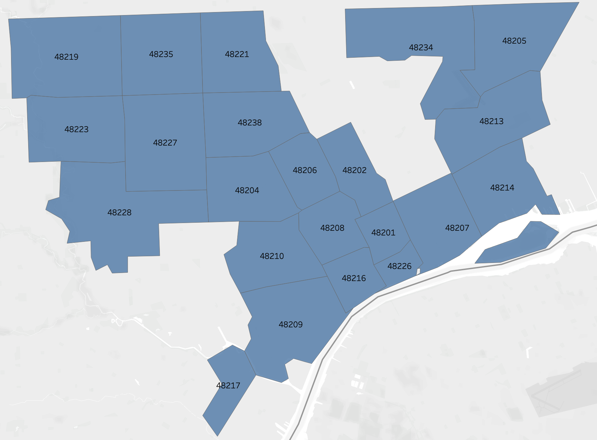
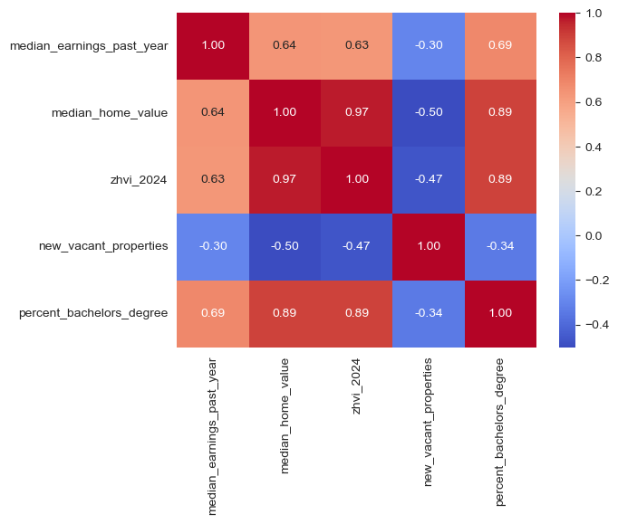

# Debris Removal Requests in Detroit and Social Economic Status

## Executive Summary
This project analyzes how the overall socioeconomic status impacts the volume of Improve Detroit debris-related requests that residents make in different neighborhoods.

Using OLS regression, the analysis found that newly vacant properties are most strongly associated with requests per resident (the dependent variable). Median earnings from the previous year (2021) and home values (from both the Census Bureau and Zillow) also show a strong negative association with requests per resident. Additionally, the analysis suggests that a higher educational level (defined as the percentage of bachelor’s degree holders) contributes to a decrease in debris-related requests. However, higher gross rent does not impact the number of debris-related incidents, nor does the percentage of poverty.

A model using median earnings from the last year and new vacant properties was fitted (Adjusted R<sup>2</sup> 0.613). Higher home values have similar effects (they are also highly correlated with median earnings from the previous year), but median earnings proved to be a better predictor in this model.

For a full, detailed Jupyter notebook walkthrough, please use `analysis.ipynb`.

## 1. Introduction and Cleaning
Four datasets were used for this analysis. The Improve Detroit and new vacant properties datasets are from the Detroit Open Data Portal (https://data.detroitmi.gov/). The Socioeconomic Status dataset was obtained from https://www.unitedstateszipcodes.org/ based on 2020 Census and 2020 American Community Survey. The Zillow Home Value Index (ZHVI) comes from https://www.zillow.com/research/data/.

### I. Improve Detroit Dataset
There are 24 columns in this dataset for 513,460 requests. Each entry has geographical information, the nature of the request, the description, the timeline of the request being solved by the city, the status of the request, an optional description allowing the reporter to provide more information, the reporting method, a URL to the platform for more detailed information, a unique ID, and a priority code.
#### i. Extracting Zip Codes and Cleaning using Majority Reported
Around 99.84% of the requests have a zip code associated with them. However, some entries have wrong zip codes. The City of Detroit assigns an address ID to an individual address. Using a table associating the majority of zip codes reported with that address ID, I fixed the wrong zip codes and added missing zip codes for 3,017 requests. There are still less than 0.15% of requests with missing zip codes, and they were removed from the dataset for this analysis.
#### ii. Selecting debris-Related Requests 
There are 27 different types of requests (categories) in this dataset. I selected debris-related variables from the top 10 most used categories (347,994 or 72.5% of total requests) to analyze.


The City of Detroit introduces new categories from time to time and made subsets for better classification, as shown in the chart below.


Some of these categories have “agency only” in the title, meaning they can only be used by city workers. However, city workers are also freely available categories for intended for general pulic.

##### Using NLP to understand "DPW DR Coordinator - DPW use only"
Using unigram NLP on the descriptions, I determined that this category is also used for debris-related requests.


Five categories were selected from the most used categories and aggregated into a general debris category. These total 118,302 requests.

| Issues                                   | Notes                                                                                                              |
|------------------------------------------|--------------------------------------------------------------------------------------------------------------------|
| DPW - Debris Removal - DPW USE ONLY      | Selected                                                                                                           |
| DPW - Other environmental - DPW USE ONLY | Not selected. City workers use it for various issues. It is sometimes related to debris, but there's no guarantee. |
| Illegal Dump Sites                       | Selected                                                                                                           |
| Curbside Solid Waste Issue               | Selected                                                                                                           |
| Abandoned Vehicle                        | Not Selected. This is not a trash or debris-related issue.                                                         |
| Tree Issue                               | Not Selected. This is not a trash or debris-related issue.                                                         |
| Curbside - DPW ONLY                      | Selected                                                                                                           |
| Traffic Sign Issue                       | Not Selected. This is not a trash or debris-related issue.                                                         |
| Rodent Extermination                     | Not Selected. This is not a trash or debris-related issue.                                                         |
| Investigate Water Main Break             | Not Selected. This is not a trash or debris-related issue.                                                         |
| DPW DR Coordinator - DPW use only        | Selected. Closer examination shows city workers are using them for debris removal.                                 |

### II. Social Economics Status Dataset
For the purpose of this project, I focused on educational and income levels from the dataset.
I performed cleaning to obtain zip codes that are 1. fully located in Detroit and 2. used in reporting.

These are the variables selected for further analysis. These statistics are based on the 2020 Census and the 2021 American Community Survey.
```python
['percent_population_in_poverty',
'median_earnings_past_year', 'median_household_income',
'median_gross_rent', 'median_home_value',
'percent_bachelors_degree','percent_graduate_degree']
```


Here is a map showing the zip code areas covered in the analysis.



### III. Vacant Property and Zillow Home Value Index Datasets

The declining Detroit economy resulted in a lot of empty property, and this could be an interesting variable to explore.
I added this information by using the Google Geocoding API to recover the reported property's zip codes from 2019 to 2024.

The Zillow Home Value Index is another measurement of the median home value. I added the latest reported index (01/2024) into the dataset to provide another perspective.

## 2. Methodology

Before performing any analysis, I normalized the debris category by dividing it by the total population in the zip codes to allow for better comparison.


After visualizing the dataset, I removed 48201 (Midtown) and 48226 (Downtown) from the dataset. Since most of the zip codes in the area are located in suburban areas and the environment in these two zip codes is too different, I identified them as outliers for the rest of the neighborhood.

I performed OLS regression on each variable listed earlier.

- Hypotheses:
  - H<sub>0</sub>: There is no significant effect of having a `lower/higher` value of `variable` on the number of requests per incident in a neighborhood.
  - H<sub>a</sub>: A `lower/higher` value of `variable` significantly affects the number of requests per incident in a neighborhood

For the final model, I first conducted a correlation test and VIF test to identify and address potential multicollinearity issues. Then, I utilized an exhaustive search based on Adjusted R<sup>2<sup/>
to select the best fitting model. I also conducted a Q-Q Plot to check for potential colinearity issues.

## 3. Results


| Variables                     | p-value    | Adj R<sup>2<sup/> |
|-------------------------------|------------|-------------------|
| percent_population_in_poverty | 0.2687     | 0.0157            |
| **median_earnings_past_year** | **0.0167** | **0.2386**        |
| median_household_income       | 0.3375     | -0.0015           |
| median_gross_rent             | 0.3108     | 0.0046            |
| **median_home_value**         | **0.0184** | **0.2315**        |
| **2024_zhvi**                 | **0.0289** | **0.1961**        |
| **new_vacant_properties**     | **0.0008** | **0.4443**        |
| percent_bachelors_degree      | 0.0677     | 0.1277            |
| percent_graduate_degree       | 0.1809     | 0.0470            |


**Final Model**:

`request_per_resident ~ new_vacant_properties + median_earnings_past_year + new_vacant_properties:median_earnings_past_year`

```markdown
 OLS Regression Results                             
================================================================================
Dep. Variable:     request_per_resident   R-squared:                       0.674
Model:                              OLS   Adj. R-squared:                  0.613
Method:                   Least Squares   F-statistic:                     11.04
Date:                  Thu, 21 Mar 2024   Prob (F-statistic):           0.000356
Time:                          22:52:19   Log-Likelihood:                 38.072
No. Observations:                    20   AIC:                            -68.14
Df Residuals:                        16   BIC:                            -64.16
Df Model:                             3                                         
Covariance Type:              nonrobust                                         
===================================================================================================================
                                                      coef    std err          t      P>|t|      [0.025      0.975]
-------------------------------------------------------------------------------------------------------------------
Intercept                                          -0.0308      0.158     -0.195      0.848      -0.366       0.305
new_vacant_properties                               0.0038      0.002      2.472      0.025       0.001       0.007
median_earnings_past_year                        4.462e-06   5.51e-06      0.809      0.430   -7.22e-06    1.61e-05
new_vacant_properties:median_earnings_past_year -1.155e-07   5.56e-08     -2.076      0.054   -2.33e-07    2.43e-09
==============================================================================
Omnibus:                        2.132   Durbin-Watson:                   2.741
Prob(Omnibus):                  0.344   Jarque-Bera (JB):                1.015
Skew:                           0.541   Prob(JB):                        0.602
Kurtosis:                       3.221   Cond. No.                     6.24e+07
==============================================================================

```


## 4. Conclusion
1. I found a strong positive association between the prevalence of `new_vacant_properties` and the volume of debris-related requests, as indicated by a highly significant p-value (0.0008) and the highest Adjusted R<sup>2</sup> value (0.4443). This could suggest that residents might be using vacant properties as dumping sites.
2. Moreover, `median_earnings_past_year` and `median_home_value` (or Zillow Home Value Index `2024_zhvi`) also showed strong statistical significance with their respective p-values. Interestingly, `median_household_income` is not statistically significant in predicting the average report per resident and has a negative adjusted R-squared, whereas `median_earnings_past_year` is highly significant.
3. Although not as strong, the educational attainment in terms of `percent_bachelors_degree` showed weak statistical significance and positive relationships with request rates, implying that education levels could lead to residents paying more attention to the cleanliness of the environment.
4. Higher `median_gross_rent` does not impact the number of debris-related incidents, nor does `percent_population_in_poverty`.
5. Using both `new_vacant_properties` and `median_earnings_past_year`, I obtained a predictive model with an adjusted R2 of 0.613. Several variables I selected had multicollinearity issues and were dropped after correlation and VIF tests.

**Limitations**

Due to the data collection methods used by the City of Detroit, it is not possible to effectively distinguish between requests submitted by city workers and those made by residents. Therefore, analyzing how residents contribute to the total volume of requests is challenging. Additionally, the focus was solely on debris-related requests, which may overlook potential trends in other types of requests. While median earnings from the previous year showed a strong negative association in decreasing requests per resident, the median household income did not. Future projects should investigate the cause of this discrepancy.

## Appendix




<table>
  <tr>
    <td></td>
    <td></td>
  </tr>
  <tr>
    <td></td>
    <td></td>
  </tr>
<tr>
    <td></td>
    <td></td>
  </tr>
    <tr>
    <td></td>
    <td></td>
  </tr>
</table>


